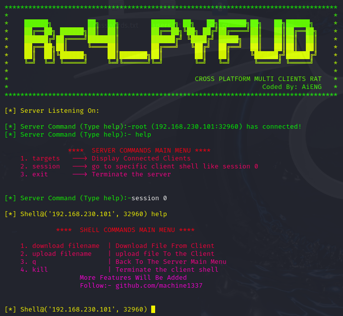

# Remote Access Tool (RAT) 使用手册
# Rc4_pyFUD

CROSS PLATFORM MULTI CLIENTS FUD RAT




## 简介

这是一个由AiENG二次开发的跨平台远程访问工具（RAT），支持多客户端连接。[原项目作者machine1337](https://github.com/machine1337/pyFUD)。本手册将指导您如何快速上手使用。

## 安装与启动

### 服务端

1. **安装Python**：确保Python环境已安装，建议**python3.x**。
2. **IP及端口修改**：使用前请注意去修改监听IP和端口，客户端也是。
3. **安装依赖**：运行以下命令安装所需库：
   ```bash
   pip install pystyle
   pip3 install pystyle
   ```
4. **启动服务端**：在终端或命令提示符中运行(根据自己环境选择python命令)：
   ```bash
   python server.py
   python3 server.py
   ```

### 客户端

1. **安装Python**：同服务端。
2. **启动客户端**：在终端或命令提示符中运行：
   ```bash
   python client.py
   python3 client.py
   ```

## 服务端命令

- `targets`：显示所有连接的客户端。
- `session [编号]`：进入特定客户端的控制台，进入控制台后可进行常规Linux命令操作（如ls、cd、cp、mkdir等）。
- `exit`：关闭服务端。

## 客户端命令

客户端自动连接到服务端，无需额外命令操作。

## 功能

- **文件管理**：上传和下载文件。
- **命令执行**：在客户端执行系统命令。
- **会话管理**：管理多个客户端连接。

## 安全与隐私

请确保在使用本工具时遵守相关法律法规，不得用于非法用途。

## 联系我们
该项目正在积极开发中。可能包含一些错误

如有任何问题或建议，[联系我们](https://github.com/GitHub-LP/EN-pyFUD/issues)。


---
